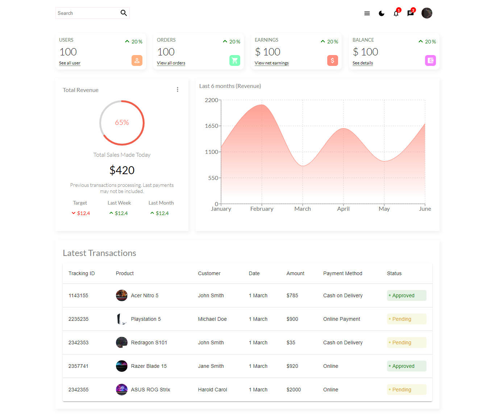
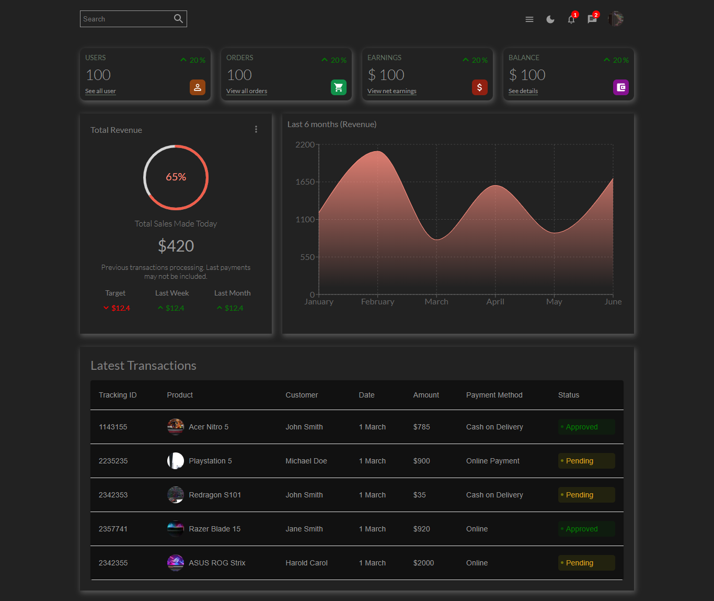
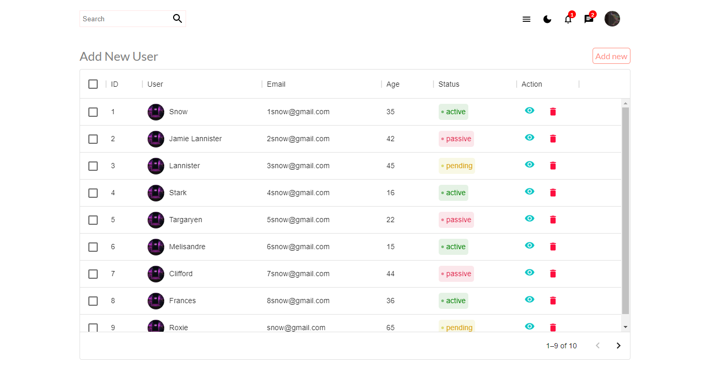
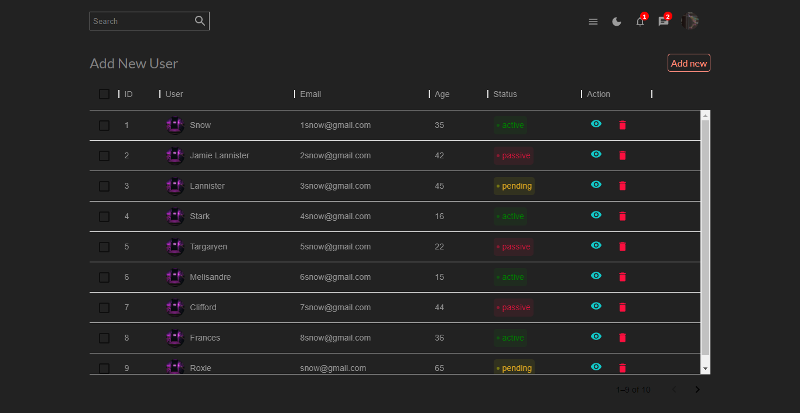
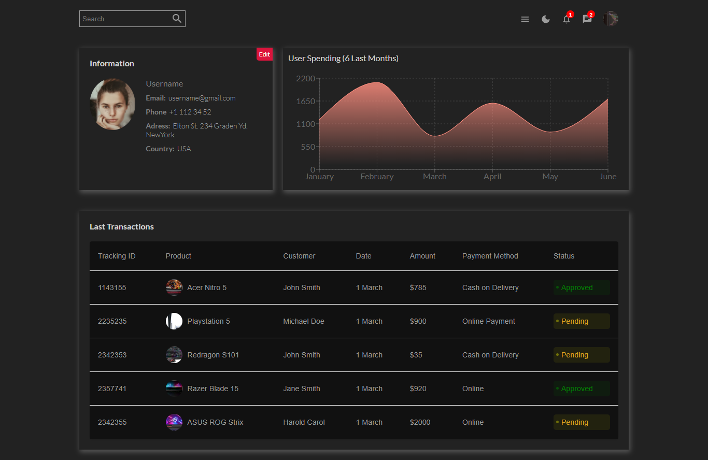
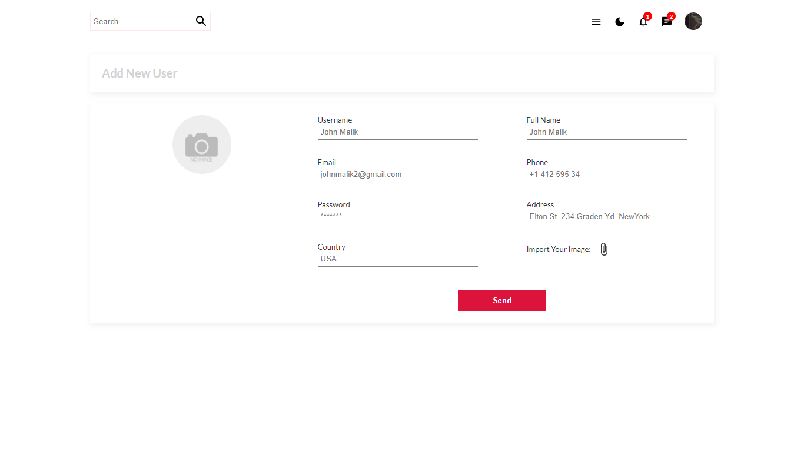
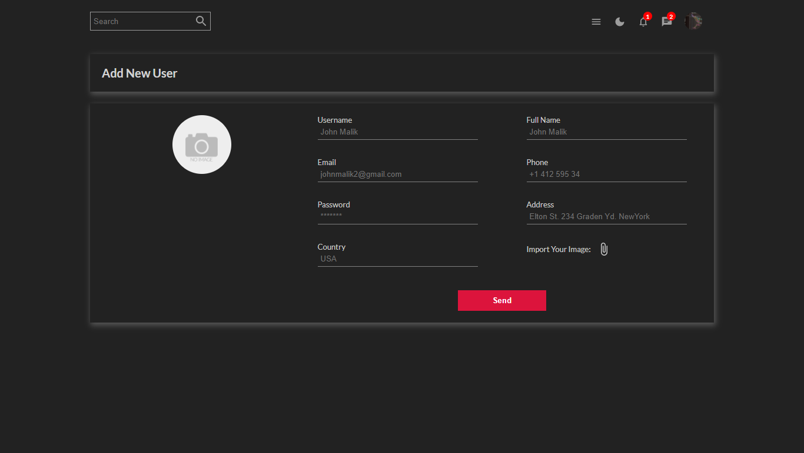

# React Admin Dashboard using React & Scss

Admin Dashboard using React & Scss

You can visite the dashboard: [React Dashboard](https://admin-dashboard-react1.netlify.app/)

- ## Light Home Page

- ## Dark Home Page

- ## Light User Page

- ## Dark User Page

- ## Light Show User Page

- ## Dark Show User Page

- ## Light New User Page

- ## Dark New User Page

- Hope you like it.
- Follow my instagram [@yassinecode](https://www.instagram.com/yassinecode/)
